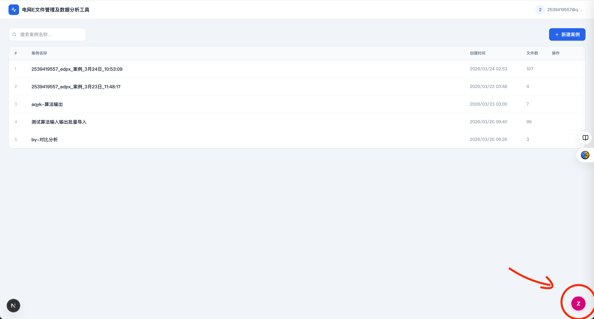
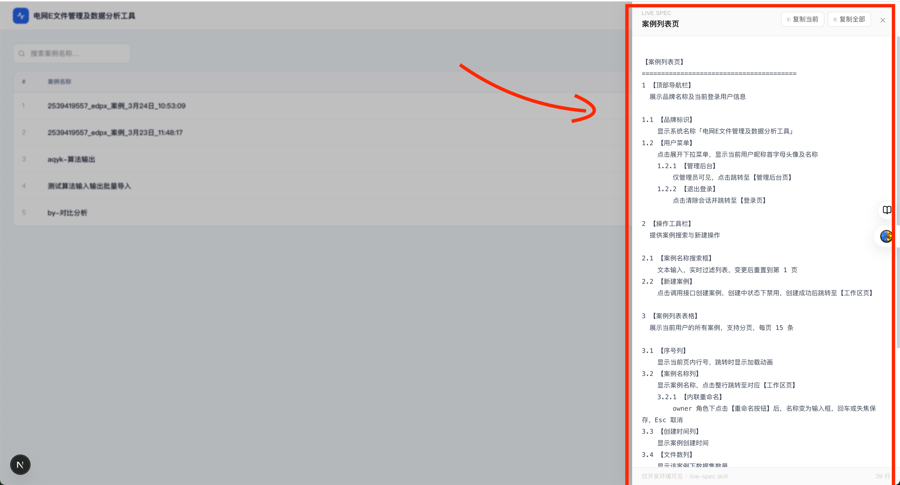

# live-spec Skill

> 产品经理专用 AI Coding Skill —— 界面与需求文档始终同步。

## 核心理念

**界面即文档，文档即界面——两者是同一事物的两面，永远同步。**

每次生成或修改页面，自动输出/更新对应的 `live-spec.ts` 需求文档，并在页面中挂载 `<LiveSpec>` 悬浮球组件，开发时随时可查看当前页面的结构化需求说明。

---

## 效果预览

页面右下角自动挂载悬浮球，点击展开当前页面的结构化需求文档：





---

## 安装与使用

### Claude Code（推荐，功能完整）

将 `live-spec/` 目录复制到 Claude Code 的 skills 目录：

```bash
cp -r live-spec ~/.claude/skills/
```

在项目中使用斜杠命令：

| 命令 | 说明 |
|------|------|
| `/live-spec <路径>` | 为指定页面生成/同步需求文档，例：`/live-spec app/dashboard` |
| `/live-spec all` | 批量处理项目所有页面 |
| `/live-spec init` | 仅安装 LiveSpec 悬浮球组件，不生成需求文档 |
| `/live-spec tag` | 扫描所有页面，为有变更的页面打版本快照 |
| `/live-spec tag "备注"` | 同上，附加备注文字，例：`/live-spec tag "客户评审版"` |
| `/live-spec help` | 显示帮助信息 |

也可以直接用自然语言告诉 Claude："生成需求文档"、"更新需求说明"、"同步需求"、"加上需求悬浮球"，Skill 会自动触发。

---

### Cursor / Windsurf

将 `live-spec/SKILL.md` 内容粘贴到 `.cursorrules`（Cursor）或 `.windsurfrules`（Windsurf），用自然语言触发，如"帮我生成这个页面的需求文档"。不支持 `/live-spec tag`。

---

### Gemini CLI

将 `live-spec/SKILL.md` 内容粘贴到项目根目录的 `GEMINI.md`，用自然语言触发。不支持 `/live-spec tag`。

---

### Claude Web（Projects）/ Gemini Web（Gems）

将 `live-spec/SKILL.md` 内容粘贴到 Project 自定义指令（Claude）或 Gem 系统指令（Gemini），把页面代码粘贴进对话后触发，手动复制输出到项目。不支持 `/live-spec tag`。

---

## 工作原理

1. **确保 `LiveSpec` 组件存在** — 自动在 `components/LiveSpec.tsx` 创建或升级悬浮球组件
2. **融合三路信息源** — 对话上下文（最高优先级）+ 源码推断 + 合理推断
3. **生成结构化需求文档** — 按视觉顺序组织层级，精确的编号/缩进规范
4. **写入 `live-spec.ts`** — 与页面同目录，并更新全局汇总 `live-spec.all.ts`
5. **挂载悬浮球** — 在 `page.tsx` 中自动引入 `<LiveSpec>` 组件

启动 dev server 后，右下角悬浮球 **Z** 即可查看/复制需求文档。

---

## 文件结构

```
your-project/
├── components/
│   └── LiveSpec.tsx          # 悬浮球组件（自动生成）
├── live-spec.all.ts          # 全项目需求汇总（自动生成）
└── app/
    └── dashboard/
        ├── page.tsx          # 已挂载 <LiveSpec>
        ├── live-spec.ts      # 当前页面需求文档
        └── live-spec.history.ts  # 版本历史（tag 后生成）
```

---

## LiveSpec 悬浮球功能

- **查看需求文档** — 以结构化文本展示当前页面的完整需求
- **版本对比** — 选择历史版本，高亮显示新增/删除/修改的条目
- **复制当前页** — 一键复制当前页面需求文档
- **复制全部** — 一键复制全项目需求文档（用于 PRD 导出）
- **仅开发可见** — `NODE_ENV !== 'development'` 时自动不渲染，生产无影响

---

## 需求文档格式示例

```
1 【页面标题区】
  显示当前页面名称，右侧展示操作入口

1.1 【新增】
    点击打开【新增弹窗】
  1.1.1 【新增弹窗】
      用于新增一条记录
      1.1.1.1 【名称】
          文本输入框，必填，最多 64 字符
      1.1.1.2 【确认】
          提交表单，校验通过后保存并刷新列表

2 【数据列表】
  展示记录列表，支持分页、排序、行内操作

2.1 【操作列】
    包含：【编辑】【删除】
```

---

## Skill 文件说明

```
live-spec/
├── SKILL.md                          # Skill 主配置（Claude Code 读取）
└── references/
    ├── format-spec.md                # 需求文档格式规范参考
    └── LiveSpec.tsx.template         # 悬浮球组件模板
```
